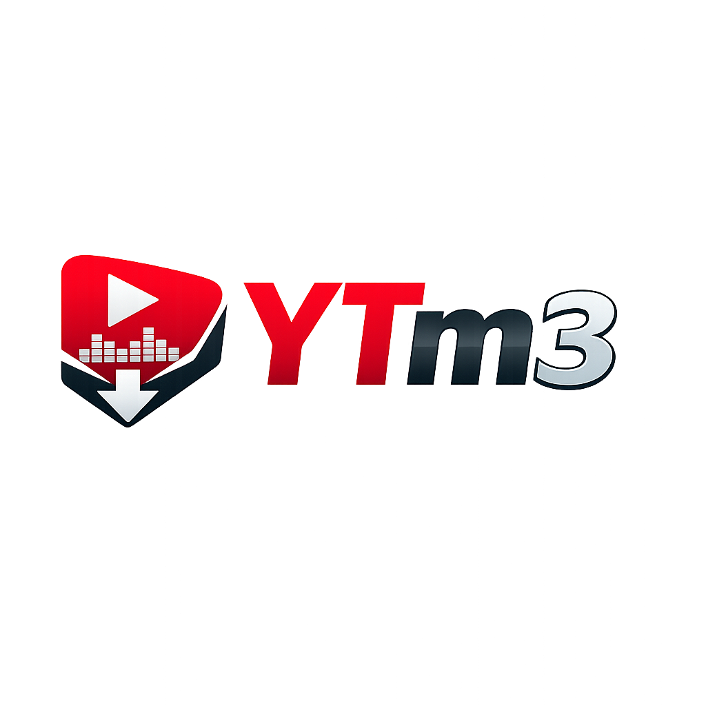

# YTm3 — YouTube Audio Converter & Downloader

A lightweight, high-performance web application to convert and download audio from YouTube videos in maximum available quality. Built with Python (Flask), `yt-dlp`, and modern Vanilla HTML5/CSS3/JavaScript.

<p align="center">
  
</p>
## Features

- **Max Quality Extraction**: Automatically detects and streams the highest available bitrate audio directly from YouTube.
- **Universal YouTube Link Support**: Robust URL parsing handles videos, shorts, live streams, `music.youtube.com`, and playlist URLs cleanly.
- **Audio Stream Preview**: Built-in HTML5 player lets users preview the extracted audio before downloading.
- **Pill-Rounded Minimalist UI**: Clean, light-mode interface with zero clutter.
- **Recent Download History**: Saves your converted tracks locally in your browser's `localStorage`.
- **Production Ready**: Configured for WSGI servers (`gunicorn`) with dynamic port binding for cloud deployments.

---

## Tech Stack

- **Backend**: Python 3.10+, Flask, `yt-dlp`, `requests`, `gunicorn`
- **Frontend**: HTML5, Vanilla CSS3 (Custom Design System), JavaScript (ES6+)
- **Icons & Typography**: Font Awesome 6, Google Fonts (Poppins)

---

## Quick Start (Local Development)

### 1. Clone the repository

```bash
git clone https://github.com/aluukill/YTm3.git
cd YTm3
```

### 2. Set up a virtual environment (optional but recommended)

```bash
python -m venv venv
# On Windows:
venv\Scripts\activate
# On macOS/Linux:
source venv/bin/activate
```

### 3. Install dependencies

```bash
pip install -r requirements.txt
```

### 4. Configure YouTube cookies (required)

YouTube blocks unauthenticated requests. You must provide a `COOKIES.txt` file with your YouTube session cookies so `yt-dlp` can authenticate.

1. Install a browser extension:
   - [Get COOKIES.txt](https://chrome.google.com/webstore/detail/get-cookiestxt/bgaddhkoddajcdgocldbbfleckgcbcid) (Chrome)
   - [COOKIES.txt](https://addons.mozilla.org/en-US/firefox/addon/cookies-txt/) (Firefox)
2. Log into **youtube.com** in your browser.
3. Use the extension to export your cookies for `youtube.com` in **Netscape format**.
4. Save the exported file as **`COOKIES.txt`** in the project root directory.

> A pre-configured `COOKIES.txt` is included in the repository. If yours expires, replace it with a fresh export.

### 5. Run the development server

```bash
python app.py
```

Open [http://localhost:5000](http://localhost:5000) in your web browser.

---

## Production Deployment

### Using Gunicorn (Linux/Unix)

```bash
gunicorn app:app --workers 4 --threads 2 --timeout 120
```

### Deploying to Cloud Platforms (Render, Railway, Heroku)

The project includes a `Procfile` and dynamic `PORT` environment variable binding out-of-the-box. Simply connect your GitHub repository to your cloud platform and select **Python Environment**.

**Note**: `COOKIES.txt` is included in the repository, so it will be deployed automatically. If the included cookies expire, replace them with a fresh export and commit the update.

---

## API Reference

### `POST /api/info`

Fetches video metadata (title, author, thumbnail, duration, audio streams).

- **Body**: `{"url": "https://www.youtube.com/watch?v=..."}`
- **Response**: JSON metadata object.

### `GET /api/stream`

Streams the raw highest quality audio for inline HTML5 preview.

- **Query Param**: `?url=...`

### `GET /api/download`

Downloads the highest quality audio track as a file attachment.

- **Query Param**: `?url=...`

---

## Project Structure

```text
YTm3/
├── app.py              # Flask backend server & yt-dlp wrapper
├── index.html          # Frontend web layout
├── style.css           # Custom CSS design system
├── script.js           # Client-side logic & API integration
├── COOKIES.txt         # YouTube session cookies (Netscape format)
├── logo.png            # App logo asset
├── requirements.txt    # Python dependencies
├── Procfile            # Deployment process definition
├── .gitignore          # Git exclusion rules
└── README.md           # Documentation
```

---

## License

This project is open-source and available under the [MIT License](LICENSE).
